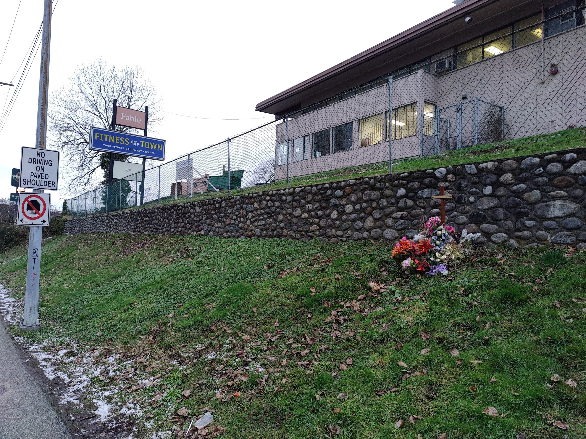

## Introduction

Commuting on the Millenium Line from East Vancouver to my school at SFU, I've often looked out the window when passing through the new Brentwood Town Centre area. Lined with new developments and lots of construction, it's always looked like it's shaping up to be pretty nice. Today, I decided to see what it's like at ground level by walking from Holdom station to Gilmore station.

## Holdom to Brentwood

Starting at Holdom, I was pleasantly surprised by how nice the station area is! There's a nice pedestrian plaza, and some shops here (bonus points for train-themed art). A lack of places to sit and hang out jumps out at me here.

After grabbing a London Fog at Starbucks, I started my journey towards Gilmore Station. There's a nice wide separated pedestrian pathway at the west end of the station.

Unfortunately, after about 50 metres, the nice pathway abruptly ends and dumps you in a giant parking lot. This pattern of nice things abruptly ending was a reoccurring theme on my walk.

The massive parking lot here belongs to Revs, a bowling alley and BBQ place. While I love bowling alleys, the building looks like it's in rough shape, and the giant parking lot here is atrocious land use considering it's so close to a SkyTrain station.

Walking past the parking lot, there's a narrow sidewalk with no road separation here. It's uneven and sloping. This looks be difficult to navigate with a personal
mobility device.

 

Between Holdom Ave and Delta Ave, there is a 800m signalized crossing gap! This gap encourages jaywalking. Lougheed Highway is _only_ 4 lanes wide here, but in worse conditions such as darkness or rain, this crossing could be even more deadly.

There's a couple dozen metres of a separated walkway here. To the South, there's a really nice plaza with a playground, but it's behind a locked gate.

 

The crosswalk at Delta and Lougheed has been thoughtfully redesigned to improve the pedestrian experience. The sidewalk balloons into the spare lane on Lougheed Highway, making the pedestrian crossing significantly shorter. On the west side of the crosswalk is a right turn lane, on the east side a bus bay.

After crossing Delta Avenue, there's a lot of construction on the new Concord Brentwood towers here. The streetscape has changed wildly and now comfortably accomodates pedestrians, cyclists, nature and everything in between. It's hard to believe this is the same road it was just a few minutes back.

There's suddenly a lot of people on the pathway; parents with their children, people walking their dogs, construction workers on their way home.

In between the giant towers here, there are large pedestrian plazas. This one happens to have an amazing little lookout platform. There's also an elevator here, down to the street below. None of this was necessary, but I'm glad the developers went out of their way to make this area just a little bit nicer.

Standing back looking at the SkyTrain tracks, the massive towers dwarf the tiny trains. Yet the towers are here because of the trains. The power of rapid transit!

At Beta Avenue, the two way separated cycle path abruptly ends in a one way painted bike gutter. This is a cyclist death trap. Cycling through this intersection looks inviting, but it's actually leading you the wrong way down one of the busiest roads in the region. Not good.

Arriving at Brentwood Station, I'm forced to cross the street due to construction but... it's a blessing! On the other side of the street is a small parcel of urbanism that reminds me of my visit to the fringes of Amsterdam.

There's a bi-level plaza here, with the main square and fountain being on the upper level, and a covered plaza for pick up and drop off down below. It's just missing more places to sit! The upper plaza is well connected to the SkyTrain station mezzanine.

## Brentwood to Gilmore

Like the first section but in reverse, this section gradually goes from comfortable to perilous.

The separated bike path here frustratingly becomes completely unprotected right before the intersection. This means right turning drivers have the opportunity to cut through. It seems completely pointless to me, not sure who this is supposed to benefit.

 

There's a new development here – the SoLo district. It's cute! Reminds me of Marine Gateway. There's a grocery store, a liquor store, and other amenities here. However, there is a dire lack of bike parking here. I think all of the bike racks around the SoLo district could maybe hold 30 bikes max.

 

There is an _amazing_ crossing here at Lougheed and Rosser. There's a comfortable, covered, and green island to wait in-between light cycles. However there should be no need to wait there, since there is an ample amount of time allocated for pedestrians to cross. Additionally, through traffic on Rosser is not permitted, so pedestrians need not watch for left-turners.

More of these crossings on Lougheed please!

 

There's an unfortunate reminder of the price of bad urbanism here, along with a sign reminding drivers to not drive on the paved shoulder. The shoulder – which is a "bike lane" – is completely unprotected, and is easily mistakable for a shoulder in which a driver could pull over. There are some rubber pylons on the line near intersections, but in the sections in bewteen, nothing.

 

At Lougheed and Gilmore, many of the sidewalks here are understandably closed due to construction. The Gilmore Place development is absolutely massive, the scale is hard to convey with my phone camera.

 

Around the station, there's some nice mixed use, lower density development. The station plaza has some... interesting art and is generally very pleasant.

## Conclusion

My time walking through Brentwood wasn't exactly what I expected. I was both pleasantly and unpleasantly surprised. There's a strange mix of walkable city and perilous urbanism that only a highway strip mall transitioning to a high density walkable neighbourhood could harbour.

This nonchalant combination creates a bizzare and dangerous urban landscape. A lot is changing for the better at Brentwood, but until then it remains a curious twilight zone of urbanism.

